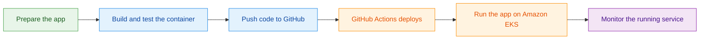
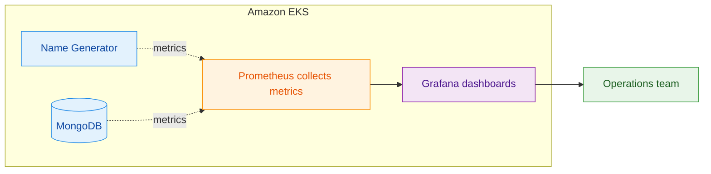

# Name Generator: DevOps Deployment project

This project deploys the Name Generator application to Amazon EKS with Docker, GitHub Actions, and Prometheus/Grafana monitoring.

## Deployment workflow

<p align="center">
  
  &nbsp;&nbsp;→&nbsp;&nbsp;
  
  &nbsp;&nbsp;→&nbsp;&nbsp;
  
  &nbsp;&nbsp;→&nbsp;&nbsp;
  
  &nbsp;&nbsp;→&nbsp;&nbsp;
  <strong>AWS EKS</strong>
  &nbsp;&nbsp;→&nbsp;&nbsp;
  
</p>



The logos above show the tools involved; the diagram shows the outcome of each stage in plain language.


## 1. Clone the source and create a repository

Clone the application source code, then initialize your own Git repository if the source is not already tracked.

```bash
git clone <SOURCE_REPOSITORY_URL> namegen-project
cd namegen-project
git init
git add .
git commit -m "first commit massage"
```

Create an empty GitHub repository and add it as the remote:

```bash
git remote add origin https://github.com/<GITHUB_USER>/namegen-project.git
git branch -M master
git push -u origin master
```

## 2. Create and test the Docker image

Create `docker/dockerfile`:

```dockerfile
FROM node:18-alpine
WORKDIR /usr/src/app
COPY package*.json ./
RUN npm install
COPY . .
EXPOSE 8080
CMD ["node", "server.js"]
```

Build the image from the repository root:

```bash
docker build -f docker/dockerfile -t namegen:local .
```

Start the container with a reachable MongoDB URL, then verify that the app responds:

```bash
docker run --rm -p 8080:8080 -e MONGODB_URL=<MONGODB_URL> namegen:local
curl http://localhost:8080/api/random_name
```

## 3. Add Amazon EKS and Kubernetes manifests

Create the following folders and files:

```text
aws_eks/cluster.yaml
k8s/DB-sts.yaml
k8s/deployment.yaml
k8s/storage-class.yaml
```

The Kubernetes resources should provide:

- `DB-sts.yaml`: the MongoDB StatefulSet, headless service, and persistent volume claim. The GitHub Actions workflow creates the MongoDB Secret from repository secrets before applying this file.
- `deployment.yaml`: the Name Generator Deployment, Service, container port `8080`, and MongoDB username, password, and URL environment variables.
- `storage-class.yaml`: the storage class used by MongoDB persistence.
- `cluster.yaml`: an EKS cluster configuration named `namegen-cluster` in the selected AWS Region.

Store strong MongoDB credentials in the GitHub repository secrets `MONGODB_USERNAME` and `MONGODB_PASSWORD`. The deployment workflow creates or updates the Kubernetes Secret without writing the credentials to the repository.

Example cluster configuration:

```yaml
apiVersion: eksctl.io/v1alpha5
kind: ClusterConfig

metadata:
  name: namegen-cluster
  region: us-east-2

autoModeConfig:
  enabled: true
```

Commit and push the infrastructure files:

```bash
git add docker aws_eks k8s
git commit -m "Add container and Kubernetes deployment manifests"
git push
```

## 4. Create the EKS cluster

Sign in to the AWS Console and open CloudShell. install eksctl,clone github repository to aws, then create the cluster from the repository's `aws_eks/cluster.yaml` file:

```bash
# for ARM systems, set ARCH to: `arm64`, `armv6` or `armv7`
ARCH=amd64
PLATFORM=$(uname -s)_$ARCH

curl -sLO "https://github.com/eksctl-io/eksctl/releases/latest/download/eksctl_$PLATFORM.tar.gz"

# (Optional) Verify checksum
curl -sL "https://github.com/eksctl-io/eksctl/releases/latest/download/eksctl_checksums.txt" | grep $PLATFORM | sha256sum --check

tar -xzf eksctl_$PLATFORM.tar.gz -C /tmp && rm eksctl_$PLATFORM.tar.gz

sudo install -m 0755 /tmp/eksctl /usr/local/bin && rm /tmp/eksctl

. <(eksctl completion bash)

eksctl create cluster -f aws_eks/cluster.yaml
aws eks update-kubeconfig --name namegen-cluster --region us-east-2
kubectl get nodes
```

## 5. Configure GitHub Actions access to AWS

Create an IAM role for GitHub Actions that uses GitHub's OIDC provider. Restrict its trust policy to the intended GitHub organization, repository, and `master` branch. Grant the role only the permissions required to:

- authenticate to Amazon ECR and push the application image;
- describe the EKS cluster;
- update Kubernetes resources in `namegen-cluster`.

Add the IAM role to the cluster as an EKS access entry. Associate an appropriate access policy, such as `AmazonEKSClusterAdminPolicy` for a learning environment; use a least-privilege access policy in production.

Github actions role policy:
```json
{
    "Version": "2012-10-17",
    "Statement": [
        {
            "Sid": "ECRAuthToken",
            "Effect": "Allow",
            "Action": "ecr:GetAuthorizationToken",
            "Resource": "*"
        },
        {
            "Sid": "ECRPushPullOps",
            "Effect": "Allow",
            "Action": [
                "ecr:BatchCheckLayerAvailability",
                "ecr:BatchGetImage",
                "ecr:InitiateLayerUpload",
                "ecr:UploadLayerPart",
                "ecr:CompleteLayerUpload",
                "ecr:PutImage"
            ],
            "Resource": "arn:aws:ecr:<region>:<aws_user_id>:repository<ECR_repository>"
        },
        {
            "Sid": "EKSdescribecluster",
            "Effect": "Allow",
            "Action": [
                "eks:DescribeCluster"
            ],
            "Resource": [
                "arn:aws:eks:<region>:<aws_user_id>:cluster/<cluster_name>"
            ]
        }
    ]
}
```

Github actions role Trust relationships:
```json
{
    "Version": "2012-10-17",
    "Statement": [
        {
            "Effect": "Allow",
            "Principal": {
                "Federated": "arn:aws:iam::<aws_user_id>:oidc-provider/token.actions.githubusercontent.com"
            },
            "Action": "sts:AssumeRoleWithWebIdentity",
            "Condition": {
                "StringEquals": {
                    "token.actions.githubusercontent.com:aud": "sts.amazonaws.com",
                    "token.actions.githubusercontent.com:sub": "repo:<Github_user@unique_user_id>/<Github_repo@unique_repo_id>:ref:refs/heads/master"
                }
            }
        }
    ]
}
```

```bash
aws eks create-access-entry \
  --cluster-name namegen-cluster \
  --principal-arn arn:aws:iam::<AWS_ACCOUNT_ID>:role/<GITHUB_ACTIONS_ROLE>

aws eks associate-access-policy \
  --cluster-name namegen-cluster \
  --principal-arn arn:aws:iam::<AWS_ACCOUNT_ID>:role/<GITHUB_ACTIONS_ROLE> \
  --policy-arn arn:aws:eks::aws:cluster-access-policy/AmazonEKSClusterAdminPolicy \
  --access-scope type=cluster
```

Keep account IDs, role names, AWS Regions, and registry locations in GitHub Actions variables or secrets; do not commit credentials.

## 6. Create the GitHub Actions workflow

Create `.github/workflows/main.yml`. The workflow should run on pushes to `master` and perform these actions:

1. Checkout code.
2. Configure temporary AWS credentials.
3. confirm AWS credentials.
4. login to Amazon ECR.
5. Build, tag, and push image to Amazon ECR.
6. Configure eks access.
7. Install or upgrade `kube-prometheus-stack` in the `monitoring` namespace.
8. Create or update the `mongodb-credentials` Kubernetes Secret from the `MONGODB_USERNAME` and `MONGODB_PASSWORD` repository secrets.
9. Apply the Kubernetes manifests and update the application image.
10. Wait for the application rollout to finish.

Set these repository variables or secrets before running the workflow:

| Name | Purpose |
| --- | --- |
| `aws-region` | Region containing EKS and ECR. |
| `role-to-assume` | IAM role assumed by GitHub Actions. |
| `role-session-name` | Unique name for the temporary AWS role session, generated from the GitHub Actions run ID for auditing and CloudTrail tracking. |
| `ECR_REGISTRY` | ECR registry . |
| `ECR_REPOSITORY` | ECR repository name for the application image. |
| `IMAGE_TAG` | get image tag. |
| `MONGODB_USERNAME` | MongoDB root username created by the MongoDB container. |
| `MONGODB_PASSWORD` | MongoDB root password created by the MongoDB container. |

Commit and push the workflow to start the pipeline:

```bash
git add .github/workflows/main.yml
git commit -m "Add EKS deployment workflow"
git push
```

Use the GitHub Actions run logs to confirm the image was pushed and the Kubernetes rollout completed.

## 7. Install kube-prometheus-stack in the cluster

<p align="center">
  
  &nbsp;&nbsp;→&nbsp;&nbsp;
  
  &nbsp;&nbsp;→&nbsp;&nbsp;
  
  &nbsp;&nbsp;→&nbsp;&nbsp;
  
</p>

Install the Prometheus Operator, Prometheus, Grafana, Node Exporter, and kube-state-metrics in the EKS cluster with the `kube-prometheus-stack` Helm chart. Run these commands from a workstation or CloudShell with the EKS kubeconfig already configured:

```bash
helm repo add prometheus-community https://prometheus-community.github.io/helm-charts
helm repo update

helm upgrade --install kube-prometheus-stack prometheus-community/kube-prometheus-stack \
    --namespace monitoring \
    --create-namespace \
    --wait
```

Verify that the monitoring workloads are ready:

```bash
kubectl get pods -n monitoring
kubectl get prometheus,servicemonitor -n monitoring
```

For a local Grafana session, forward the Grafana service port:

```bash
kubectl port-forward -n monitoring svc/kube-prometheus-stack-grafana 3000:80
```

Open `http://localhost:3000`. The chart provisions Prometheus as Grafana's data source and includes dashboards for:

- EKS node CPU, memory, and disk utilization;
- pod health, restarts, and replica counts;
- application availability and request rate;
- MongoDB availability and storage use.



## Validation checklist

- Docker image builds and serves `GET /api/random_name` locally.
- GitHub Actions completes successfully after a push to `master`.
- `kubectl get pods` shows healthy Name Generator and MongoDB workloads.
- The application LoadBalancer endpoint is reachable.
- Grafana displays current EKS, application, and MongoDB metrics.
